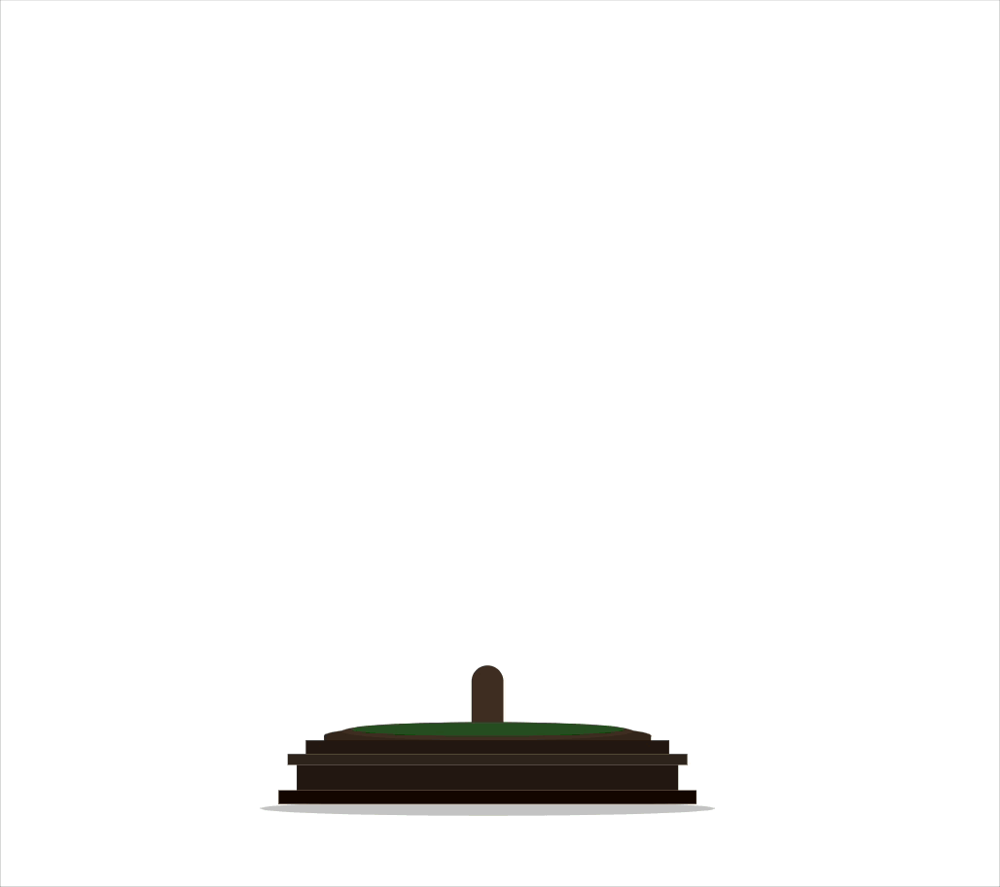

# Svelte Bonsai

<div style="display: flex; align-items: center; gap: 20px;">
  
  
</div>

A customizable bonsai tree component for Svelte that grows and animates over time.

## Installation

```bash
npm install svelte-bonsai
```

## Usage

```svelte
<script>
  import { BonsaiTree } from 'svelte-bonsai';
</script>

<BonsaiTree 
  width={600} 
  height={600} 
  autoGrow={true} 
  loopGrow={false} 
  growthInterval={1000} 
/>
```

## Props

- `width` (number, default: 600): Width of the SVG canvas
- `height` (number, default: 600): Height of the SVG canvas
- `autoGrow` (boolean, default: true): Whether the tree should automatically grow
- `loopGrow` (boolean, default: false): Whether the tree should reset and regrow after reaching full growth
- `growthInterval` (number, default: 1000): Time in milliseconds between growth stages

## Methods

The component exposes the following methods:

- `grow()`: Manually trigger a growth stage. Returns false when fully grown.
- `reset()`: Reset the tree to its initial state.
- `resetAndGrow()`: Reset the tree and start auto-growing again.

## Example

```svelte
<script>
  import { BonsaiTree } from 'svelte-bonsai';
  let bonsaiComponent;
</script>

<BonsaiTree 
  bind:this={bonsaiComponent}
  width={600} 
  height={600} 
  autoGrow={false} 
/>

<button on:click={() => bonsaiComponent.grow()}>
  Grow
</button>
<button on:click={() => bonsaiComponent.reset()}>
  Reset
</button>
<button on:click={() => bonsaiComponent.resetAndGrow()}>
  Reset & Auto-grow
</button>
```

## License

MIT
